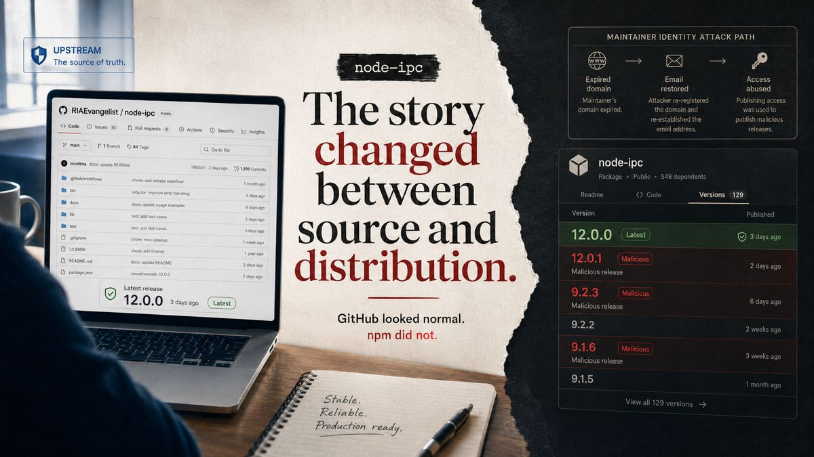

# 1. Background

## 1.1 What is node-ipc?

### A Node.js inter-process communication library

`node-ipc` is an open-source JavaScript library for inter-process communication (IPC).
It lets separate Node.js processes exchange messages and coordinate, a common need for multi-process applications, CLI tooling, and local services.
The public project lives at `RIAEvangelist/node-ipc`.

### Why it is widely deployed

`node-ipc` is one of the most widely adopted packages in the Node.js ecosystem.
It has accumulated over 2 billion downloads on npm, with a monthly download volume in the millions.

That ubiquity is precisely what made the incident consequential. Because the package is ordinary and trusted, a large number of developer workstations and CI environments install and run it without second thought.
When a malicious version appears through the official npm channel, those same environments are the ones that may resolve and load the compromised code, which is the core of the source vs. distribution gap described in this report.

## 1.2 The source-vs-distribution gap

In May 2026, three malicious [node-ipc](https://www.npmjs.com/package/node-ipc) releases appeared on npm while the upstream project still showed `12.0.0`.
The gap exposed how much modern software depends on trust outside the code we can see.

On 2026-05-14, the upstream [node-ipc](https://github.com/RIAEvangelist/node-ipc) repository on GitHub still pointed to version `12.0.0` and appeared much as it had before.
The software arriving through npm, however, no longer matched what the source page showed.

That day, three malicious versions of `node-ipc`—`9.1.6`, `9.2.3`, and `12.0.1`—appeared through the official npm distribution channel.
The difference was confined to a version number, but it reflected a significant gap between the code developers inspect and the package they install: the two are not necessarily governed by the same systems, credentials, or trust relationships.

For most developers, the distinction is almost invisible.
GitHub is where a project is read, discussed, and reviewed; npm is where the package is retrieved.
In ordinary use, they feel like two windows onto the same thing.
The `node-ipc` incident made clear that they are not.
A source repository can remain unchanged while the distribution path around it changes completely.

That was what made the incident larger than a single case of malicious code.
The package name remained familiar, the installation command remained familiar, and the project developers recognized was still there.
What had changed was the chain of authority behind the package being delivered to them.

Modern software depends on that chain.
Applications are assembled from libraries, frameworks, build tools, and packages maintained by people all over the world.
Each installation assumes that the software delivered through a registry is the software its maintainers intended to publish.
