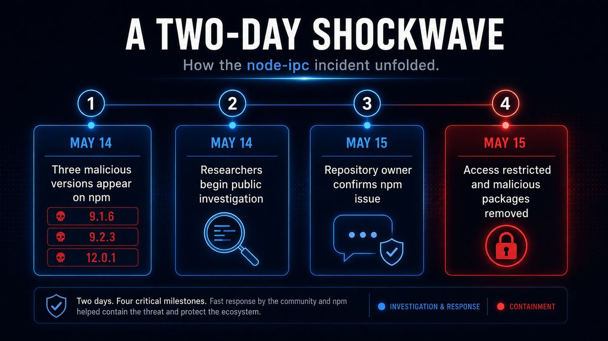

# 2. Incident Overview

## 2.1 Incident record

This section records the technical facts from the incident record, with a confidence rating for each claim. Each claim carries a confidence rating — Confirmed, Supported, Plausible, or Not established (definitions in Appendix B).

### Origin of the public report

The public incident began with [GitHub issue #15](https://github.com/RIAEvangelist/node-ipc/issues/15), opened on **2026-05-14 at 15:01:21Z**, titled *"[SECURITY][REPORT] node-ipc@12.0.1 CJS bundle contains obfuscated infostealer payload."* The report states that malicious code had been appended to the CommonJS bundle after the legitimate `module.exports` boundary.

The issue documents a package shasum for `12.0.1`:

```
fe5d107b9d285327af579259a32977c4f475fa26
```

### Affected versions

Version `9.1.6` was added in a contemporaneous GitHub issue discussion, and it is confirmed affected in the incident record. Version `9.2.3` was reported by an independent investigator in a GitHub issue, and it is confirmed affected in the incident record. Version `12.0.1` is documented by the original issue and technical analysis, and it is confirmed affected.

### Release timing

The investigation record reports a rapid three-release sequence: `12.0.1`, followed ~30 seconds later by `9.2.3`, then ~30 seconds later by `9.1.6`. The comment gives a first clock time of **14:25:30** but does not state a timezone; this report does not invent one.

### Entry point and execution condition

The issue states that the malicious code existed in `node-ipc.cjs`, the CommonJS entry point, while the ESM entry point `node-ipc.js` and other source files were clean. That distinction matters operationally: package presence alone was not equivalent to malicious execution. The highest-risk condition was a consumer environment that resolved an affected npm version and then loaded the compromised CommonJS path.

### Verification in the issue thread

A researcher responding to the issue reported manually confirming the compromise and notifying npm security. The same thread identified `9.2.3`, `12.0.1`, and then `9.1.6` as affected.

## 2.2 Timeline

After researchers identified the malicious releases, the incident progressed quickly, moving from malicious publication to public investigation and containment within two days.

### 2026-05-07 — atlantis-software.net registration created

The current registration for `atlantis-software.net` was created at 11:49:33Z, as observed in preserved WHOIS output (evidence strength: High). The domain had lapsed and later returned under new control (WHOIS/DNS detail and the conflicting re-registration dates are in Section 5.2).

### 2026-05-14 07:26:10Z — azurestaticprovider.net creation observed in WHOIS

The creation timestamp for `azurestaticprovider.net` was observed in WHOIS (evidence strength: High). The domain family is associated with `sh.azurestaticprovider.net`, the resolver/C2-related host; the creation timestamp falls on the same date as the malicious `node-ipc` publication, though timing alone does not establish operator identity (WHOIS/DNS detail in Section 4.6).

### 2026-05-14 14:25:30 — First malicious publish (timezone unstated)

An investigator reported the first malicious publish (`12.0.1`), followed by `9.2.3` and then `9.1.6` at ~30-second intervals (evidence strength: Medium/High; investigator report). The record gives a first clock time of 14:25:30 but does not state a timezone, and this report does not invent one.

### 2026-05-14 15:01:21Z — [GitHub security issue #15](https://github.com/RIAEvangelist/node-ipc/issues/15) opened

The public incident began with GitHub issue #15, opened at 15:01:21Z (evidence strength: High). The title and the package shasum are recorded in Section 2.1.

### 2026-05-14 — Independent confirmation and npm security notification

An independent investigator reported manually confirming the compromise and notifying npm security (evidence strength: High). The same issue thread identified `9.2.3`, `12.0.1`, and then `9.1.6` as affected, expanding the affected version set.

### 2026-05-15 — Evidence screenshots preserved

WHOIS, npm/GitHub profile, and DNS screenshots were preserved during the investigation (evidence strength: High). These correspond to the compiled investigation screenshots (`NODE-IPC.pdf`, artifact E-02) and the original screenshot archive (`Attachments.zip`, artifact E-03).

### 2026-05-15 — Repository owner restricted write access

The repository owner reported restricting write access to himself (evidence strength: High as a first-party remediation statement).

### 2026-05-16 13:43 — Final preserved reply captured

Final preserved reply captured from `a.tiertant@atlantis-software.net` (SPF/DKIM pass) (evidence strength: High for mail infrastructure use). The evidentiary value is operational mailbox control, not confession (mailbox exchange and header detail in Section 5.2).

### 2026-05-19 16:02 -0400 — Preservation request sent to Namecheap

A preservation request was sent to Namecheap regarding `atlantis-software.net` (evidence strength: High) (preservation request and registrar response in Section 5.2).

### 2026-05-19 20:03Z — Namecheap acknowledges report

Namecheap acknowledged the report (evidence strength: High) and stated that it would be reviewed (preservation request and registrar response in Section 5.2).

### 2026-05-22 20:51Z — Namecheap: allegation not validated

Namecheap said the allegation could not be validated from the supplied evidence and that legal process is required for preservation (evidence strength: High) (preservation request and registrar response in Section 5.2).



### Containment timing

The incident was contained within two days: on 2026-05-15 the repository owner restricted write access to himself, and the contemporaneous evidence (WHOIS, npm/GitHub profile, and DNS screenshots) was preserved the same day. Trust is accumulated gradually, but a single change in publishing authority can alter what a familiar package name delivers within hours.
