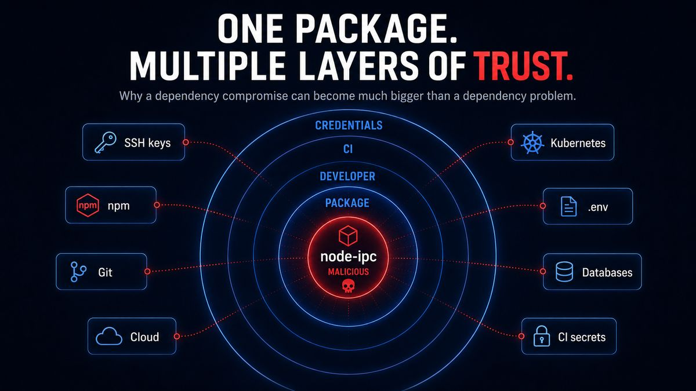
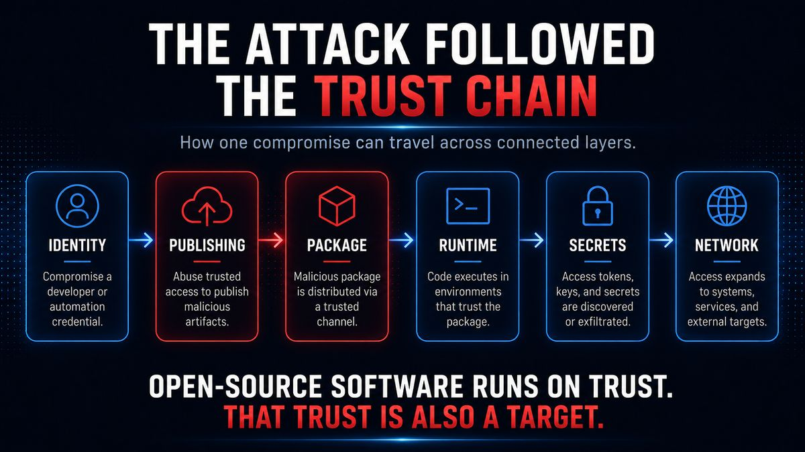

# 3. Impact Assessment

## 3.1 Why the developer environment is the target

A developer laptop is rarely just a laptop, and a CI runner is rarely just a machine that runs tests.
These environments sit at the intersection of an organization's code, credentials, infrastructure, and release process.
They may be able to reach private repositories, cloud services, deployment platforms, package registries, Kubernetes clusters, internal databases, and production-adjacent systems.

That makes the development environment an attractive place for a supply-chain attack to land.
The attacker does not need to discover every service from the outside if the compromised code runs somewhere those services are already trusted.
Existing permissions, configuration files, tokens, and automation can turn the development environment into a map of the organization around it.

This is why a small dependency can produce outsized concern.
The package itself may represent only a tiny fraction of an application's codebase, but its position inside the development process can give it proximity to systems far more valuable than the package itself.

A useful analogy is not a thief breaking into every building on a street, but someone compromising the courier who already has keys, routes, and permission to enter.

Open-source software works because developers do not build everything themselves.
A modern application may rely on hundreds or thousands of components maintained by people the application team will never meet.
This arrangement lets small teams build large systems by inheriting years of work from the ecosystem around them.

They inherit something else as well.
Every dependency brings assumptions about who controls it, how releases are published, and what the package will be allowed to do once it reaches a developer workstation or CI environment.
Most of those assumptions remain invisible until one of them fails.

The malicious [`node-ipc`](https://www.npmjs.com/package/node-ipc) releases were designed to inspect developer and CI environments for sensitive information.
Their targets were developer and CI credentials and configuration (the full collection-target breakdown is in Section 4.2).
These were not simply interesting files on a machine; many represented access to the systems developers use to build, deploy, and operate software.

That proximity is what gave the compromise its reach.
A third-party package running in a development environment may sit only a few steps away from private repositories, cloud accounts, deployment infrastructure, and production-adjacent systems.
The dangerous part of a malicious dependency is therefore not only the code inside it, but the environment that agrees to run it.

A compromised dependency does not need to attack every downstream system directly.
If it reaches an environment that already possesses legitimate access, some of the hardest work has already been done for it.

The value of the target lay not in the package contents but in the environments that would execute it.

## 3.2 How trust propagates through the supply chain

The `node-ipc` incident crossed layers that software teams manage as separate problems.
A maintainer identity can possess publishing rights.
Publishing rights determine what appears in a registry.
The registry supplies software to developer machines and CI systems.
Those systems contain credentials and configuration.
Those credentials can lead to larger environments.

Seen that way, `node-ipc` was not only an [npm](https://www.npmjs.com) incident.
It was an identity incident, a distribution incident, and a developer-security incident.
Each layer inherited confidence from the one before it.
The package was trusted partly because the registry delivered it; the registry release was trusted partly because valid publishing authority had produced it; the code was allowed to run because all of those earlier assumptions normally hold.

For a broader threat-model perspective on how supply-chain compromises propagate across trust boundaries, see [StepSecurity's writeup](https://www.stepsecurity.io/blog/node-ipc-npm-supply-chain-attack).

This is both the strength and the weakness of modern software reuse.
Developers can build extraordinary systems because they do not have to renegotiate every trust relationship from first principles each time they install a package.
But the same efficiency means risk can also be inherited.

This does not argue against open source; modern software development would be nearly impossible without it.
It does argue for treating trust as something to be re-verified over time, because a package can deserve confidence for years and still become dangerous if control of its publishing path changes.

## 3.3 Capability vs impact & exposure states

The incident should be evaluated as a sequence of increasingly strong impact states, rather than as a single binary outcome.
Each state proves something different, and the investigation's confidence in each state differs accordingly.

The "Malicious version published" state proves that a supply-chain compromise exists, with a status of Confirmed in this investigation.
The "Package selected/downloaded" state proves potential consumer exposure, with a status of Environment-specific in this investigation.
The "Compromised CJS loaded" state proves that the malicious runtime path was reached, with a status of Requires victim evidence in this investigation.
The "Collection observed" state proves that host secrets were actually read, with a status of Requires victim evidence in this investigation.
The "Archive staged" state proves that the collection pipeline progressed, with a status of Requires victim evidence in this investigation.
The "DNS-exfiltration queries emitted" state proves that an exfiltration attempt occurred, with a status of Requires DNS/host evidence in this investigation.
The "Remote receipt proven" state proves that the attacker received victim data, with a status of Not established in this investigation.

This distinction is operationally important for incident response.
A host that merely contains a malicious package may warrant investigation and secret rotation based on risk, but the forensic statement should not be upgraded to "confirmed data theft" without supporting telemetry.
Stages marked *Requires victim evidence* or *Not established* cannot be asserted from the package contents alone; they depend on host-level telemetry (process, filesystem, and DNS records) specific to each affected machine.
Where that evidence is absent, the correct statement is a risk-based recommendation, not a confirmed impact claim.

The boundary between **capability** and **impact** is the core of this assessment.
A malicious package that contains credential-collection and DNS-exfiltration code demonstrates what the payload *can* do; it does not by itself prove that a specific consumer executed the payload, that credentials were collected from that consumer, or that data was successfully received by a remote operator.
Capability is established from the code; impact requires evidence from the victim environment.
Conflating the two overstates the incident and can misdirect response effort.
