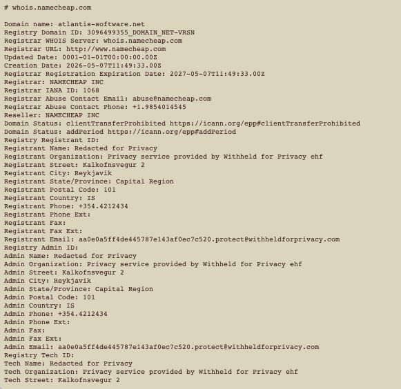
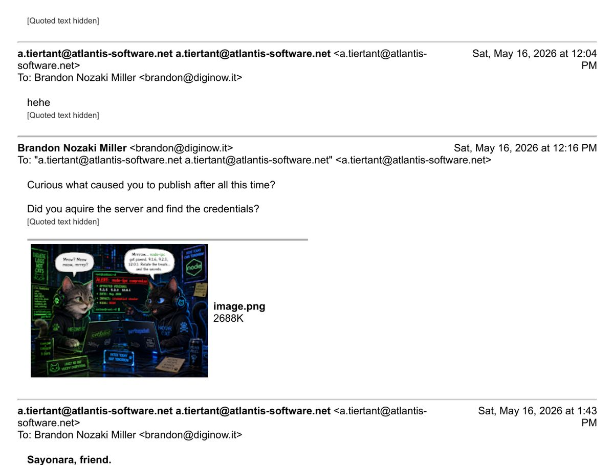
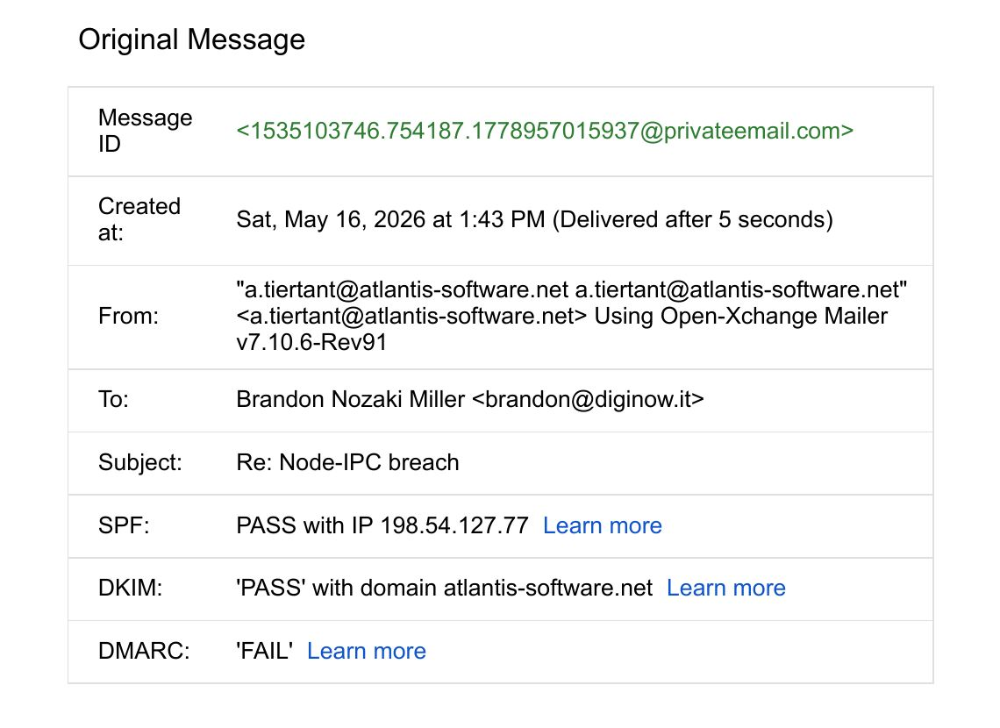
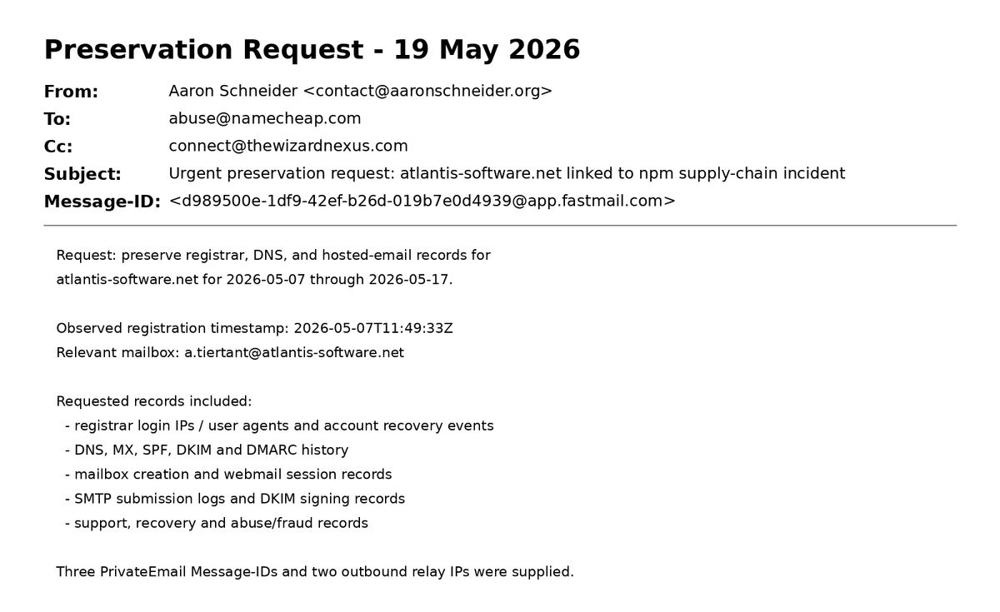

# 5. Attribution & Evidence

## 5.1 Maintainer identity & publishing path

### Introduction

The strongest public connection between the malicious [npm](https://www.npmjs.com) artifacts and a maintainer identity appears in the [issue #15](https://github.com/RIAEvangelist/node-ipc/issues/15) investigation thread.
Investigators reported that the malicious tarballs contained:

```
_npmUser: atiertant
```

with the associated email:

```
a.tiertant@atlantis-software.net
```

One investigator described this as a likely "Email Takeover."
A later comment explicitly acknowledged uncertainty: the domain had expired, it was registered again, and the attacker **likely** used the mailbox to reset the npm password.
That distinction matters.
The evidence supports a plausible recovery path but does not establish the exact mechanism of npm account takeover.

### What the evidence supports

`atiertant` was a known maintainer identity associated with `node-ipc`.
Investigators reported that the malicious tarballs carried `atiertant` npm publisher metadata.
The public/display email associated with that npm identity used `atlantis-software.net`.
The domain was under a new/current registration before the malicious publication.
PrivateEmail infrastructure was configured and the mailbox was demonstrably capable of sending authenticated mail after the incident.

### What the evidence does not include

npm password-reset records, which would directly show whether a recovery was performed, are absent from the evidence.
npm login IPs, which could place an actor at the publisher account, are not included.
npm MFA/recovery logs, which would distinguish login from recovery and show which channels were used, are missing.
A registrar account login history tying domain control to the npm publisher session, which is needed to connect domain control to the publishing event, is not available.
Human identity evidence for the mailbox operator, which would move attribution beyond infrastructure control, is lacking.

The absence of these artifacts means the chain from domain reacquisition to a concrete npm password reset is inferred, not directly observed.
Where a claim rests on inference rather than a preserved record, this document marks it as plausible rather than confirmed.

### Github profile evidence

Common DevOps security researcher (Aaron Schneider) screenshot preserved the GitHub profile associated with `atiertant` during the investigation (source: original May 2026 screenshot archive).
This capture is contextual evidence only.
It establishes how the account and its associated projects appeared at the time, but it does not prove that the GitHub account itself was compromised or used to publish the npm malware.


The consolidated root-cause statement is given in Section 6.

## 5.2 Domain, email & registrar evidence

### `atlantis-software.net` registration

The WHOIS capture preserved by the investigator records the details of the domain visible during the incident.

The domain was `ATLANTIS-SOFTWARE.NET`.
The registrar was [Namecheap](https://www.namecheap.com), Inc.
The creation date was `2026-05-07T11:49:33Z`.
The nameservers were `DNS1.REGISTRAR-SERVERS.COM` and `DNS2.REGISTRAR-SERVERS.COM`.
The registrant details were privacy-protected.



This capture materially strengthens the 2026-05-07 date.
It is a snapshot of registry/registrar output taken at the time, not a later narrative recollection.

#### Conflicting re-registration dates

A GitHub comment elsewhere in the incident thread asserted a **2026-03-10** re-registration date.
A later investigator comment stated **2026-05-07** and said the exact prior expiry could not be determined.
The primary WHOIS capture and the subsequent preservation request both support the 2026-05-07 creation timestamp for the registration visible during the incident.

#### Conclusions

The current registration's creation timestamp was observed at `2026-05-07T11:49:33Z`, with high confidence.
The exact date the prior registration expired is not established by the preserved evidence.
The historical "re-registration" chronology before 2026-05-07 is not fully established from the preserved evidence.

### Direct exchange with the mailbox

A preserved six-message thread shows the repository owner emailing `a.tiertant@atlantis-software.net` after the incident became public.
Replies were received from that address.
The exchange included short responses such as "meow" and "hehe."
The owner then asked whether the sender had acquired the server and found credentials.
The final reply was "Sayonara, friend."



The evidentiary value here is **operational mailbox control**, not confession.
The final response does not admit server acquisition, password recovery, npm access, or malware publication.

### Authentication of the final reply

The original-message export for the final reply records:

The Message-ID was `<1535103746.754187.1778957015937@privateemail.com>`.
It was created on 2026-05-16 at 1:43 PM.
The From field was `a.tiertant@atlantis-software.net`.
The mailer was Open-Xchange Mailer v7.10.6-Rev91.
[SPF](https://datatracker.ietf.org/doc/html/rfc7208) was **PASS** with IP `198.54.127.77`.
[DKIM](https://datatracker.ietf.org/doc/html/rfc6375) was **PASS** with domain `atlantis-software.net`.
[DMARC](https://datatracker.ietf.org/doc/html/rfc7489) was **FAIL**.



SPF/DKIM success is meaningful because it shows the message was sent through infrastructure authorized for the domain and carried a valid domain signature at that time.
It does **not** authenticate the human identity of the sender.
Domain control and identity are separate propositions.

### Preservation request and registrar response

On **2026-05-19**, a preservation request was sent to Namecheap regarding `atlantis-software.net`.
It supplied the observed registration timestamp, the relevant mailbox, an incident link, three PrivateEmail Message-IDs, and two outbound relay observations.

The request asked Namecheap to preserve several categories of records.

Domain registration-account details would identify who registered and controlled the domain.
Registrar login IPs and user agents could place an actor at the account.
Account creation, recovery, and password-reset events are central to testing whether the domain mailbox was used to recover the npm account.
DNS and mail-record history would show when authoritative records were configured for the new registration.
Mailbox creation time helps date when the operational mailbox came into use.
Webmail sessions could tie a human operator to the mailbox.
SMTP submission logs corroborate the preserved outbound relay observations.
DKIM signing records support authentication of the preserved replies.
Support/recovery records may document recovery actions taken on the account.
Related abuse or fraud flags would indicate prior warnings to the registrar.



Namecheap acknowledged receipt on 2026-05-19 and stated that the report would be reviewed.

On **2026-05-22**, Namecheap responded that it had investigated "to the extent of our capabilities" but could not validate the allegation from the supplied evidence.
It requested additional evidence and stated that preservation requests are processed upon receipt of a **U.S. court order or subpoena** by the Senior Legal department.

#### Legal/evidentiary boundary

A preservation request was submitted.
Namecheap acknowledged and reviewed it.
The available correspondence does **not** establish that the requested records were preserved.
No registrar account, webmail-session, or npm-recovery logs were obtained through this process.
