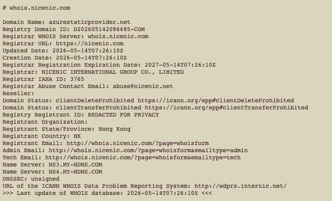
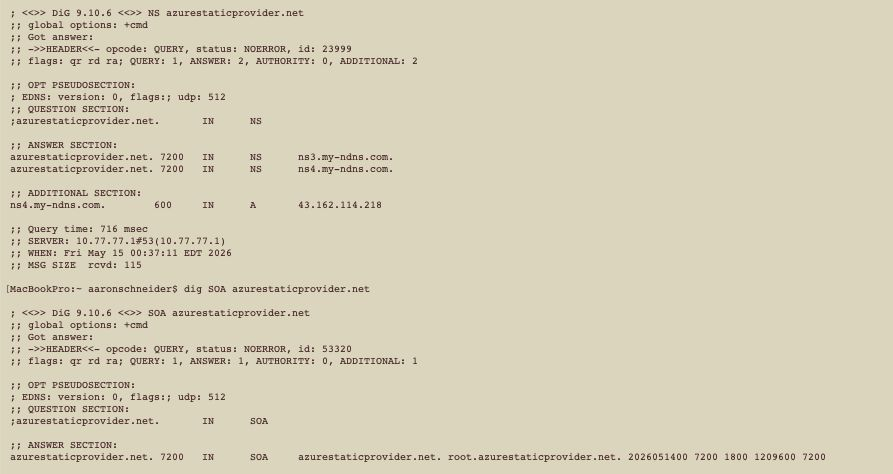

# Technical Attack Reconstruction

This section reconstructs the technical behavior documented in the public incident record for the affected `[node-ipc](https://www.npmjs.com/package/node-ipc)` releases (`9.1.6`, `9.2.3`, `12.0.1`). It separates what the code is demonstrated to do from what cannot be concluded without host, DNS, or receiver-side evidence.

## 1. Entry point and execution condition

The malicious code was appended to `node-ipc.cjs`, the CommonJS entry point. The ESM entry point `node-ipc.js` and the other source files were clean. This distinction matters operationally: package presence alone was not equivalent to malicious execution. The highest-risk condition was a consumer environment that resolved an affected version and then loaded the compromised CommonJS path.

A defensible exposure sequence is:

1. Affected version selected
2. Package downloaded or installed
3. Compromised CommonJS entry point loaded
4. Malicious code executed
5. Collection activity occurred
6. Archive was staged
7. DNS exfiltration queries were emitted
8. Remote receipt occurred

Only steps 1-3 can be inferred from dependency/package state. Steps 4-8 require progressively stronger host, DNS, or receiver-side evidence. A host that merely contains a malicious version may warrant investigation and secret rotation based on risk, but the forensic statement should not be upgraded to confirmed execution or confirmed data theft without supporting telemetry.

## 2. Reconnaissance and credential collection

The incident report documents a range of credential-collection targets.

The targets include the OS platform, architecture, hostname, home directory, and temporary directory, which establish the host's identity and layout for the operator. The `uname -a` output adds kernel and build details to that host profile. The process ID and working directory pin down where the process is running from. All environment variables may contain credentials, tokens, and configuration. The `/etc/hosts` file can reveal internal network mappings. SSH keys and configuration provide direct access to private repositories and servers. Shell history and profiles may expose commands, hosts, and inline secrets. Cloud-provider credentials and configuration grant access to cloud accounts and infrastructure. Kubernetes configuration can reach cluster workloads and secrets. Application and developer configuration often embeds connection strings and API keys. Source-control and package-management material exposes credentials for repositories and registries. Other files likely to contain secrets cover additional secret-bearing files the operator may value.

This establishes **collection capability**. It does not establish which of these files actually existed on any specific victim host.

## 3. Staging and encoding

The payload was reconstructed as building a tar archive with a custom implementation and compressing the result with `zlib.gzipSync()`. The public reconstruction shows staging beneath a temporary `nt-*` path and includes a manifest-like `_paths.txt` file.

This design minimizes the number of independent outbound operations: many local files are normalized into a single compressed object before exfiltration.

## 4. DNS exfiltration design

The reconstructed code uses DNS query names as the data channel. It divides encoded archive material into chunks and constructs a header/data/footer sequence using three short prefixes.

For an independent breakdown of this payload and its DNS exfiltration mechanism, see [Datadog Security Labs' malware analysis](https://securitylabs.datadoghq.com/articles/node-ipc-npm-malware-analysis/).

The `xh` prefix denotes the header, the `xd` prefix carries the data chunks, and the `xf` prefix denotes the footer.

The issue discussion identifies `sh.azurestaticprovider.net` as the resolver/C2-related host and `bt.node.js` as the query suffix used by the reconstructed protocol.

The practical detection lesson is that defenders cannot restrict their analysis to DNS answers. **The query name itself is the payload carrier.**

## 5. Process behavior and cleanup

The public incident analysis reports a detached child process, environment guards such as `__ntw` / `__ntRun`, and deletion of staged temporary material. Those behaviors support stealth and execution separation.

The available evidence does **not** establish a durable autorun or persistence mechanism. Detaching a process from its parent is not, by itself, persistence across reboot or login.

## 6. C2 and DNS Infrastructure Investigation

The investigation also preserved WHOIS and DNS observations for `azurestaticprovider.net`, the domain family associated in the GitHub issue with `sh.azurestaticprovider.net`.

The captured WHOIS result records the details of the domain as observed during the investigation.

The creation date is 2026-05-14T07:26:10Z, the registrar is NICENIC INTERNATIONAL GROUP CO., LIMITED, the nameservers are `NS3.MY-NDNS.COM` and `NS4.MY-NDNS.COM`, and the registrant is privacy-redacted.

The creation timestamp falls on the same date as the malicious `node-ipc` publication. The same investigation captured DNS responses for the domain and its authoritative nameserver set.

The timing is suspicious and technically relevant, but timing alone does not establish operator identity. Likewise, later DNS misconfiguration or inconsistent referrals cannot prove evasive intent.
